<div align="center">

# 🎙️ SnapSound Backend

### **AI-Powered Document-to-Podcast Conversion Engine**

[](https://python.org)
[](https://fastapi.tiangolo.com)
[](https://ai.google.dev)
[](https://cloudinary.com)

*Transform documents, images, and visual content into engaging multi-speaker podcasts using cutting-edge AI*

---


</div>

---

## 📋 Table of Contents

- [Overview](#-overview)
- [Architecture](#-architecture)
- [Technology Stack](#-technology-stack)
- [Core Components](#-core-components)
- [API Reference](#-api-reference)
- [Processing Pipeline](#-processing-pipeline)
- [Configuration](#-configuration)
- [Deployment](#-deployment)

---

## 🎯 Overview

The SnapSound Backend is a high-performance FastAPI service that orchestrates the complete document-to-podcast transformation pipeline. It leverages **Google's Gemini AI** ecosystem for intelligent content processing and natural multi-speaker voice synthesis.

### Key Capabilities

| Feature | Description |
|---------|-------------|
| 📄 **Multi-Format Support** | PDF, DOCX, PPTX, CSV, Excel, TXT, and images |
| 🖼️ **Visual AI Analysis** | Gemini Vision extracts insights from graphs, charts, and diagrams |
| 🎭 **Multi-Speaker TTS** | Natural dialogue with distinct voices (Gemini 2.5 TTS) |
| 📝 **Smart Transcripts** | Auto-generated podcast transcripts with source summaries |
| ☁️ **Cloud-Native** | Cloudinary integration for scalable media delivery |

---

## 🏗️ Architecture

The backend follows a **modular pipeline architecture** with clear separation of concerns:

```
┌─────────────────────────────────────────────────────────────────┐
│                     FastAPI Application Layer                     │
├─────────────────────────────────────────────────────────────────┤
│  ┌──────────────┐  ┌──────────────┐  ┌──────────────────────┐  │
│  │   /convert   │  │   /health    │  │  CORS Middleware     │  │
│  └──────────────┘  └──────────────┘  └──────────────────────┘  │
├─────────────────────────────────────────────────────────────────┤
│                      Processing Engine                           │
│  ┌────────────────────────────────────────────────────────────┐ │
│  │  Content Extraction → Vision AI → Script Gen → TTS Engine  │ │
│  └────────────────────────────────────────────────────────────┘ │
├─────────────────────────────────────────────────────────────────┤
│                      External Services                           │
│  ┌──────────────┐  ┌──────────────┐  ┌──────────────────────┐  │
│  │ Gemini API   │  │ Gemini TTS   │  │    Cloudinary        │  │
│  │ (V1 + V2)    │  │ (2.5 Flash)  │  │    (Storage)         │  │
│  └──────────────┘  └──────────────┘  └──────────────────────┘  │
└─────────────────────────────────────────────────────────────────┘
```

---

## 🛠️ Technology Stack

<div align="center">


</div>

### Core Framework

| Technology | Version | Purpose |
|------------|---------|---------|
| **FastAPI** | 0.100+ | High-performance async web framework |
| **Uvicorn** | Latest | ASGI server with production-ready performance |
| **Pydantic** | V2 | Data validation and settings management |

### AI & Machine Learning

| Technology | Model | Purpose |
|------------|-------|---------|
| **Google Generative AI** | `gemini-2.0-flash` | Script generation with JSON schema enforcement |
| **Gemini Vision** | `gemini-2.0-flash` | Image/diagram analysis and description |
| **Gemini TTS** | `gemini-2.5-flash-preview-tts` | Multi-speaker voice synthesis |

### Document Processing

| Library | Formats | Capabilities |
|---------|---------|--------------|
| **pypdf** | PDF | Text extraction + embedded image extraction |
| **python-docx** | DOCX | Paragraph, table, and image extraction |
| **python-pptx** | PPTX | Slide content and embedded media |
| **pandas** | CSV, XLSX | Tabular data to markdown conversion |
| **Pillow** | PNG, JPG, etc. | Image preprocessing for Vision AI |

### Cloud Services

| Service | Purpose |
|---------|---------|
| **Cloudinary** | Audio/transcript CDN with auto-optimization |

---

## ⚙️ Core Components

### 1. Content Extraction Engine

The extraction engine handles multiple file formats with specialized extractors:

```python
def extract_content(file_path: str) -> dict:
    """Extract text and visual content from various file formats"""
    # Returns: {"text": str, "image_descriptions": List[str]}
```

**Extraction Flow:**
- **PDF**: `pypdf.PdfReader` for text + XObject parsing for images
- **DOCX**: `python-docx` for paragraphs/tables + relationship parsing for images
- **PPTX**: `python-pptx` for slide text + shape image blob extraction
- **Tabular**: `pandas` with markdown rendering

<div align="center">


</div>

### 2. Gemini Vision AI Analysis

Each extracted image is analyzed using Gemini's multimodal capabilities:

```python
def analyze_image_with_gemini(image_bytes: bytes, image_index: int) -> str:
    """Analyze images for graphs, charts, diagrams, infographics"""
    model = genai_v1.GenerativeModel('gemini-2.0-flash')
    # Converts visual content to podcast-ready descriptions
```

**Analysis Capabilities:**
- 📊 **Graphs/Charts**: Trend analysis, key data points, numerical insights
- 🔀 **Diagrams**: Component relationships and concept explanations
- 📋 **Infographics**: Key information summarization
- 🖼️ **Photos**: Contextual description and relevance

### 3. AI Script Generation

Transforms extracted content into a structured two-speaker podcast dialogue:

```python
class DialogueLine(BaseModel):
    speaker: str  # "Siya Ram" or "Radhe Shyam"
    text: str

class PodcastScript(BaseModel):
    title: str
    dialogue: List[DialogueLine]
```

**Script Features:**
- **Siya Ram**: Energetic host, leads the conversation
- **Radhe Shyam**: Expert guest, provides insightful explanations
- JSON schema enforcement via `response_mime_type: "application/json"`

### 4. Multi-Speaker TTS Engine

<div align="center">


</div>

Advanced voice synthesis using Gemini 2.5 TTS Preview:

```python
speech_config = types.SpeechConfig(
    multi_speaker_voice_config=types.MultiSpeakerVoiceConfig(
        speaker_voice_configs=[
            types.SpeakerVoiceConfig(
                speaker="Siya Ram",
                voice_config=types.VoiceConfig(
                    prebuilt_voice_config=types.PrebuiltVoiceConfig(
                        voice_name="Aoede"  # Warm, engaging host voice
                    )
                )
            ),
            types.SpeakerVoiceConfig(
                speaker="Radhe Shyam", 
                voice_config=types.VoiceConfig(
                    prebuilt_voice_config=types.PrebuiltVoiceConfig(
                        voice_name="Charon"  # Deep, authoritative expert voice
                    )
                )
            )
        ]
    )
)
```

**Audio Processing Pipeline:**
1. **Script Formatting**: Dialogue lines with speaker tags
2. **Voice Configuration**: Distinct voices per speaker
3. **API Generation**: Non-streaming for chunk error prevention
4. **WAV Conversion**: Raw PCM → WAV with proper headers

### 5. Audio File Processing

Custom WAV file generation with proper RIFF header construction:

```python
def convert_to_wav(audio_data: bytes, mime_type: str) -> bytes:
    """Generate WAV file with proper headers"""
    # Parses sample rate and bit depth from MIME type
    # Constructs RIFF/WAVE header structure
    # Returns complete WAV file bytes
```

**WAV Header Structure:**
| Field | Size | Description |
|-------|------|-------------|
| ChunkID | 4 bytes | "RIFF" |
| ChunkSize | 4 bytes | File size - 8 |
| Format | 4 bytes | "WAVE" |
| Subchunk1ID | 4 bytes | "fmt " |
| AudioFormat | 2 bytes | 1 (PCM) |
| NumChannels | 2 bytes | 1 (Mono) |
| SampleRate | 4 bytes | 24000 Hz |
| BitsPerSample | 2 bytes | 16 |

---

## 📡 API Reference

### POST `/api/convert`

Convert uploaded file to podcast audio with transcript.

**Request:**
```
Content-Type: multipart/form-data

file: <binary>     # Document or image file
host_url: string   # Host URL for callbacks
```

**Response:**
```json
{
  "success": true,
  "audioUrl": "https://res.cloudinary.com/.../audio.wav",
  "transcriptUrl": "https://res.cloudinary.com/.../transcript.txt",
  "title": "Generated Podcast Title",
  "requestId": "uuid-v4"
}
```

**Supported File Types:**
| Category | Extensions |
|----------|------------|
| Documents | `.pdf`, `.docx`, `.pptx`, `.txt` |
| Spreadsheets | `.csv`, `.xlsx`, `.xls` |
| Images | `.png`, `.jpg`, `.jpeg`, `.gif`, `.bmp`, `.webp` |

### GET `/health`

Health check endpoint for monitoring.

**Response:**
```json
{
  "status": "healthy"
}
```

---

## 🔄 Processing Pipeline

```mermaid
graph TD
    A[📤 File Upload] --> B{File Type Detection}
    B -->|Documents| C[Text Extraction]
    B -->|Images| D[Direct Vision AI]
    C --> E[Image Extraction from Docs]
    E --> F[Gemini Vision Analysis]
    D --> F
    F --> G[Content Aggregation]
    C --> G
    G --> H[Script Generation<br/>Gemini 2.0 Flash]
    H --> I[Multi-Speaker TTS<br/>Gemini 2.5 Flash TTS]
    I --> J[WAV Conversion]
    J --> K[Cloudinary Upload]
    H --> L[Transcript Generation]
    L --> K
    K --> M[✅ API Response]
```



### Pipeline Stages

| Stage | Component | Technology | Output |
|-------|-----------|------------|--------|
| 1 | **Ingestion** | FastAPI UploadFile | Temp file |
| 2 | **Extraction** | pypdf/docx/pptx | Text + Images |
| 3 | **Vision Analysis** | Gemini 2.0 Flash | Image descriptions |
| 4 | **Script Generation** | Gemini 2.0 Flash | JSON dialogue |
| 5 | **Voice Synthesis** | Gemini 2.5 TTS | PCM audio |
| 6 | **Audio Processing** | struct (Python) | WAV file |
| 7 | **Cloud Upload** | Cloudinary SDK | CDN URLs |
| 8 | **Cleanup** | os module | Temp file removal |

---

## ⚙️ Configuration

### Environment Variables

```env
# Google AI Configuration
GOOGLE_API_KEY=your_gemini_api_key
# OR
GEMINI_API_KEY=your_gemini_api_key

# Cloudinary Configuration
CLOUDINARY_CLOUD_NAME=your_cloud_name
CLOUDINARY_API_KEY=your_api_key
CLOUDINARY_API_SECRET=your_api_secret

# Server Configuration
PORT=8000  # Optional, defaults to 8000
```

### Logging Configuration

The backend uses comprehensive logging with both file and console output:

```python
logging.basicConfig(
    level=logging.DEBUG,
    format='%(asctime)s - %(name)s - %(levelname)s - [%(filename)s:%(lineno)d] - %(message)s',
    handlers=[
        logging.FileHandler('podcast_generator.log'),
        logging.StreamHandler()
    ]
)
```

---

## 🚀 Deployment

### Local Development

```bash
# Install dependencies
pip install -r requirements.txt

# Run development server
python main.py
# OR
uvicorn main:app --reload --port 8000
```

### Production Deployment

```bash
# Run with production settings
uvicorn main:app --host 0.0.0.0 --port $PORT --workers 4
```

### Docker Deployment

```dockerfile
FROM python:3.10-slim

WORKDIR /app
COPY requirements.txt .
RUN pip install --no-cache-dir -r requirements.txt

COPY . .
EXPOSE 8000

CMD ["uvicorn", "main:app", "--host", "0.0.0.0", "--port", "8000"]
```

---

## 📊 Performance Characteristics

| Metric | Value | Notes |
|--------|-------|-------|
| **Avg. Processing Time** | 30-60s | Depends on file size and image count |
| **Max File Size** | ~50MB | Configurable via FastAPI |
| **Audio Quality** | 24kHz/16-bit | Mono WAV |
| **Concurrent Requests** | Limited by API quotas | Consider rate limiting |

---

## 🔐 Security Considerations

- ✅ CORS middleware configured for frontend integration
- ✅ Temporary files cleaned up after processing
- ✅ Environment-based configuration for secrets
- ✅ Input validation via Pydantic models
- ⚠️ Consider rate limiting for production
- ⚠️ Add authentication for public deployments

---

## 📦 Dependencies

```txt
fastapi>=0.100.0
uvicorn[standard]
python-multipart
pydantic>=2.0
python-dotenv

# AI & ML
google-generativeai
google-genai

# Document Processing
pypdf
python-docx
python-pptx
pandas
openpyxl
Pillow

# Cloud Services
cloudinary
requests
```

---

<div align="center">

**Developed by Ansh Singh**

[](https://fastapi.tiangolo.com)
[](https://python.org)
[](https://ai.google.dev)

</div>
